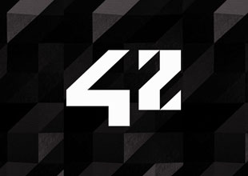

  

<h3 align="center">FT_CONTAINERS: tester</h3>

---

 This project is a tester I developed while completing the FT_CONTAINERS project at École 42.
      

## 📝 Table of Contents

- [About](#about)
- [Getting Started](#getting_started)
- [Acknowledgement](#acknowledgement)

## 🧐 About 

  

This tester is intended to be used on FT_CONTAINERS, a École 42's project in which students have to reimplement some of the STL containers, based on c++98. This tester is designed to work for the projects as per May 2021's version. Meaning it will not test the new revision and bonuses.
It performs tests to verify the student implementation based on STL behaviour and output comparison.

Tests are performed on: 

- Vector
- Stack
- Map
- List
- Set
- Deque
- Queue

Note: this test assumes you have implemented your own ft::pair (as you should).

## 🏁 Getting Started 

- First place your projects headers in directory : `./includes/your_headers_files`
- Then update the file `./includes/your_headers.hpp` to include your files.
- `make f` will precompile your headers and check their std98 compiliance, then compile the tester and run every tests.
- `make <container name>` will perform tests on a specific container.

Note: Tester will stop at the first failure (except tests performed on max_size of some containers as their result mey vary with OS, and may reflect some personnal decision on implementation which may be valid and yield to variation with STL).

## ⚠️  Acknowledgement 

Please note this test is based on my own work, you should use it as a complement of your own testes. First because it might be wrong on some points, second because you will learn much more by doing your tester than doing the project itself: you will learn how to use the STL's version, its limitations, its power etc. ... 

